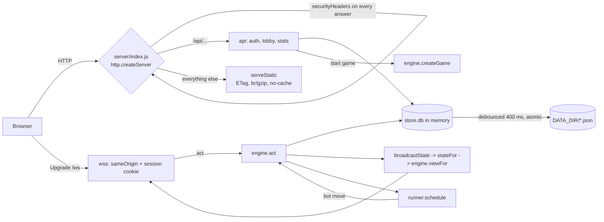
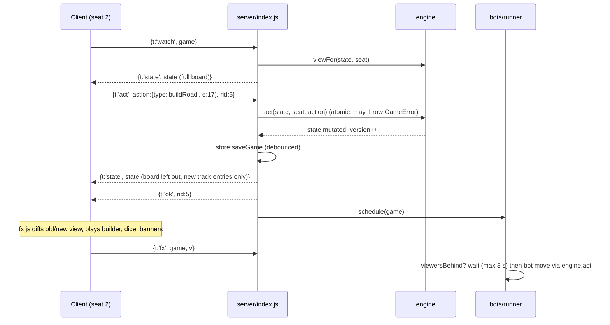
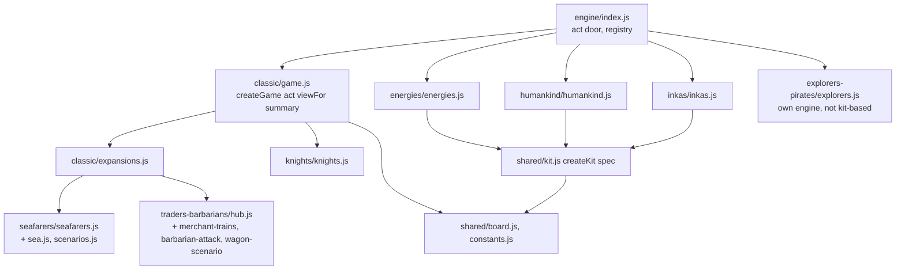
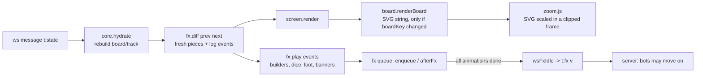
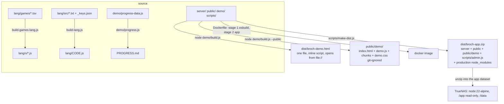

# Architecture

How Broch works, with the contracts you need to change it safely. Paths are relative to `/home/user/catan/broch` unless they start with `docs/` or `deploy/`. Companion documents: `../CLAUDE.md` (conventions, pitfalls), `OPERATIONS.md`, `RULES-AND-GAPS.md`.

## 1. The whole picture

```
 Browser (plain ES modules, no bundler)                     Server (Node 22, one process, CommonJS)
 +----------------------------------------+                 +--------------------------------------------------+
 | app.js  router, lobby, auth, profile   |   HTTPS /api    | server/index.js                                   |
 | core/*  board, zoom, fx, feed, stats   | <-------------> |   http: /api/*  +  static files (ETag, br/gzip)    |
 | games/classic/screen.js  (classic fam.)|                 |   ws:   /ws  (ws library)                          |
 | games/sgame.js + games/<id>/plugin.js  |   WebSocket     |   rate limits, sessions, CSP headers               |
 +----------------------------------------+ <-------------> |        |                       |                   |
                                                            |   server/engine/index.js      server/bots/runner.js|
                                                            |   act / viewFor / summary     (computer players)   |
                                                            |        |                                           |
                                                            |   server/engine/<game>/*  rules (pure functions)   |
                                                            |   server/store.js  -> DATA_DIR/*.json              |
                                                            +--------------------------------------------------+
```

All game state lives in server memory (`store.db.games`, a `Map` of `{ meta, state }`) and is mirrored to JSON files. There is no database and no external service. One process, one thread: engines are synchronous; scrypt runs on the libuv pool.

## 2. Request flow



Static routing (`serveStatic`): `/` and any path without a file extension return `index.html` (hash routing on the client); `/demo` and `/demo/` return `public/demo/index.html`; the file must stay inside `public/` (403 otherwise). `index.html` gets `name="broch-build" content=""` filled with `BUILD_ID` and `__ORIGIN__` replaced with the visitor's origin (for link previews). Headers: `Cache-Control: private, no-cache`, `CDN-Cache-Control: no-store`, `ETag`, `Vary: Accept-Encoding`.

### HTTP API (all JSON, `Cache-Control: no-store`)

| Route | Auth | What |
|---|---|---|
| `GET /api/config` | no | `{ build, feedbackUrl, needsCode, colors, firstUser }` |
| `POST /api/register` | no | e-mail, name (24), password (8..256), country, `code` when `REGISTRATION_CODE` is set; first account becomes admin; rate limited (15 failures / 10 min, 10 sign-ups / hour / address) |
| `POST /api/login`, `/api/logout` | no / session | sets or clears cookie `broch_session` (HttpOnly, SameSite=Lax, Secure behind https) |
| `GET/PATCH /api/me` | session | profile; PATCH name, color, country, lang, `newPassword` (+ `password`); changing the password ends the other sessions |
| `GET /api/users` | session | `publicUser` list: id, name, color, country, admin (never e-mail) |
| `GET /api/lobby` | session | `{ open, playing, mine }` as game cards |
| `POST /api/games` | session | create a game (mode, expansion, scenario, variants, house rules, gameOptions); at most 8 open or running per host |
| `GET /api/games/:id`, `POST .../color`, `.../bots`, `.../join`, `.../leave`, `.../start`, `.../resign`, `.../abandon` | session | lobby actions; start calls `engine.createGame`; resign puts a bot on the seat |
| `GET /api/stats`, `POST /api/stats/manual`, `DELETE /api/stats/:id` | session | history; manual entries for games played at a real table |
| `POST /api/client-error` | no | browser error reports into the log (20/min/address, 16 KB, sanitised) |
| `GET /api/health` | no | `{ ok, build }` (Docker healthcheck, deploy check) |

Errors are `{ error: 'English sentence' }` (the client runs it through `t()`); 5xx also carry `internal: true`, which makes the client show the "report a problem" banner.

## 3. WebSocket protocol

One socket per tab at `/ws`. The upgrade is refused unless `Origin` matches the host (`sameOrigin`) and a valid session cookie is present (otherwise the socket closes with code **4001**, which the client treats as "logged out", see `app.js` `broch:session`). The session is checked again on every message. `maxPayload` is 64 KB, more than 200 messages per second closes the socket with 1008.

```
client -> server                                   server -> client
{t:'watch', game}   start/stop watching a game     {t:'state', game, state, online}   viewFor(...) for THIS seat
{t:'act', game, action, rid}   a move              {t:'ok', rid}                      the act was accepted
{t:'fx', game, v}   "I showed everything up to     {t:'err', rid, msg, params, internal}  refused (GameError) or crashed
                     state version v"              {t:'lobby'} / {t:'stats'}          refetch the lobby / the stats
{t:'ping'}          heartbeat (every 15 s)         {t:'pong'}
                                                   {t:'abandoned'}                    the game was closed or does not exist
```



Rules of the protocol:

- `act` is only accepted from a seated player (`seatOf`); spectators get `You are watching this game.` but receive states (`viewFor(state, -1)`).
- `rid` ties `ok`/`err` to the promise returned by `wsAct()`; the client rejects after 10 s without an answer and probes the connection.
- `stateFor(c, g)` is per connection: `c.cache` remembers the last `board` JSON and `track` length. Same board -> `board` deleted and `boardSame: true`; longer `track` with the same head -> only the new entries and `trackFrom`. A (re)`watch` resets the cache. Client side: `core.js` `hydrate()` rebuilds and calls `resync()` (a new `watch`) if its copy does not fit.
- `online` is the list of seat ids with an open socket (bots always count).
- Reconnect (`core.js`): exponential back-off up to 8 s, heartbeat every 15 s with an 8 s deadline, immediate probe on `visibilitychange`/`online`/`pageshow`, hard reconnect when nothing arrives, then `{t:'lobby'}` and `{t:'stats'}` are replayed to the open screens so they refetch. Server side a 30 s WebSocket-level ping terminates dead sockets.
- Demo: `window.BROCH_MOCK` (installed by `demo/mock.js`) replaces `api()`, `wsConnect()`, `wsWatch()`, `wsAct()`; the same client runs against an in-page server.

## 4. Storage layout

`DATA_DIR` (env, default `broch/data`; `/data` in Docker and on TrueNAS):

```
DATA_DIR/
  users.json            [ {id, email, name, country, color, salt, hash, createdAt, admin, colorsV, lang?} ]   scrypt hash, 600
  users.json.bak        the save before the last one (users and history only)
  sessions.json         { sha256(token): {userId, exp} }   the cookie holds the token, the disk only its hash
  history.json          [ summary(s) of finished games without bots | manual entries ]  (+ .bak)
  games/<id>.json       { meta, state }          one file per open, running or finished game
  games/_broken/        game files that failed to load or crashed a start-up step (kept for inspection)
  *.corrupt-<time>      a damaged file that was set aside
  *.tmp                 only while a write is in flight (written, fsynced, renamed over the real file)
```

- `meta` (lobby level, written by `server/index.js`): `id, name, mode, expansion, scenario, variants, big, variable, robberReturn, startBoth, knightsFree, vpAtOnce, expBuildAnytime, expExtraStart, gameOptions, maxPlayers, vpTarget, host, seats[] (user ids or bot_ ids), colors{}, bots{id:{name}}, status ('open'|'playing'|'over'), createdAt, startedAt, finishedAt`.
- `state` (rules level, owned by the engine, `null` until the game starts): see section 5. The lobby switches are copied into `state.options` by `createGame`.
- Writes: `saveGame` is debounced 400 ms (`now=true` for lobby changes and the end of a game); users and history are written immediately with fsync and a `.bak`; `SIGTERM`/`SIGINT` flush everything (`saveEverythingNow`); `uncaughtException` logs and flushes but keeps running.
- Load (`store.js`): missing file = fresh install; unreadable/wrong shape = `.bak` if good, else `users.json` stops the server (`FATAL`), history/sessions start empty, games go to `_broken/`. Then `server/index.js` runs `engine.migrate` per game (`eachGame`), finishes games that ended but were not recorded, and restarts the bots.

## 5. Engine contracts

`server/engine/index.js` is the only module the server imports. Every game (the classic engine and each standalone game) exports:

| Call | Contract |
|---|---|
| `createGame({ id, mode, players:[{id,name,color,country}], options })` | returns a fresh JSON state. Players are shuffled into seat order. `options` carries `vpTarget, expansion, scenario, variants, big, variable` and the house-rule switches; standalone games read their own switches from `options.game`. |
| `act(state, seat, action)` | mutates `state`, `state.version++`. Throws `GameError(msg, params)` for a refused move. `engine/index.js` wraps it: validates the action shape, snapshots the state, restores it on any throw. |
| `viewFor(state, seat)` | the per-seat projection sent to clients; `seat = -1` for spectators. Contains `me`, `phase`, `step`, `turn`, `current`, `board`, `buildings`, `roads`, `players[]` (other hands as counts only), `pending[]`, `legal` (what this seat may do now), `log` (last 80), `chat`, `track`, `version`, `options`, `winner`. |
| `summary(state)` | the history record (`id, mode, expansion, scenario, vpTarget, startedAt, finishedAt, winner, players[{userId,name,color,vp,breakdown,gained,...}], rolls`). |
| `migrate(state)` | called on every stored game at start-up; brings old saves up to date in place (or returns a restarted game, as for the retired simplified Explorers & Pirates) and returns the state. |

Plus registry helpers in `engine/index.js`: `MODES`, `isStandalone`, `minPlayers`, `maxPlayers`, `defaultVp`, `fixedVp`, `vp(state, seat)`. A standalone game must expose `_internal.spec` (`vpTarget`, `maxPlayers`, `minPlayers`, `vp`, optional `vpFor(scenario)`) or `_internal.minPlayers` / `_internal.fixedVp` for these helpers.

Shared state vocabulary (classic and kit-based games): `phase` `'setup' | 'play' | 'over'`; `step` `'roll' | 'main'` (plus `'sbp'`); `current` seat; `pending[]` questions to named seats (`discard`, `moveRobber`, `steal`, ...) with a `group` (only the first group is active); `setup.queue/idx/need`; `dice`; `trade`; `flags` (per-turn); `stats`; `track` (per-turn point history for the graphs); `log` entries `{turn, k, a, at}` with `k` an English template.

Where the code lives:



- **Classic family.** `classic/game.js` builds `X = require('./expansions')(core)` and `KN = require('../knights/knights')(core)`, where `core` is an object of helper functions defined in `game.js`. The expansions never import `game.js` (no cycles); `game.js` calls their hooks at the points where they change a rule (`X.roadEdgeOk`, `X.settlementOk`, `X.viewBoard`, `KN.playerView`, `KN.pendingView`, ...), and `Object.assign(HANDLERS, KN.handlers, X.handlers)` registers their actions. Traders & Barbarians scenarios plug into `hub.js` with `make(core, HB)`.
- **Kit games.** `createKit(spec)` returns `{ HANDLERS, act, viewCommon, summary, baseState, start, legalRoads, legalSettlements, pushPending, rollDice, checkWin, nextTurn, ... }`. The spec names the hand items, costs, piece limits, supplies, `vp`, `bankRate`, `roll`, `handLimit` and the hooks (`afterSetupSettlement`, `afterBuild`, `onTurnStart`, ...). A game adds its own `HANDLERS` and builds `viewFor` on `K.viewCommon(s, me, extraPlayer)`.
- **Explorers & Pirates** is the biggest engine (`explorers.js`, ~1200 lines, boards in `eup-board.js`) and does not use the kit.

### Hidden information

`viewFor` is the privacy boundary. Examples to keep when you add fields: `players[i].res`/`dev` are `null` for other seats; development and progress decks are never sent; fog hexes are sent as `terrain:'fog'` without numbers until discovered (`expansions.js` `viewBoard`); victory point cards stay hidden until the win (unless the house rule `vpAtOnce`); pending items are copied field by field into the view (anything extra must go through `it.pub`, so a private field cannot leak by accident). After `phase === 'over'` everyone sees everything (`self = i === me || s.phase === 'over'`).

## 6. Bots

```
engine.act(...)  or  game start  or  server restart
        |
runner.schedule(g)  -- timer 650-1300 ms (BROCH_BOT_DELAY overrides) -->  step(g)
        |
viewersBehind(g)?  a seated human's c.fxV < c.sentV and < 8 s since the state was sent  -> look again in 200 ms
        |
for each bot seat (shuffled):  playOne
   1. decide(viewFor(s, seat))      bots/classic.js | bots/standalone.js   (heuristic, sees only its view)
   2. else up to 300 random moves   bots/fuzz-classic.js | fuzz-<game>.js  (lists every plausible move; offerTrade/counterTrade excluded)
   -> engine.act; first accepted move: saveGame, broadcastState, finishGame if over, schedule again
nobody could move -> a human is expected (the next human act wakes the runner) or log "Bot runner: ... is stuck"
```

The same `decide()` functions run in the demo (`demo/mock.js`), so a bot bug shows in both places. `test/rules/bot-forced-progress.js` pins the Cities & Knights deadlock (a forced progress-card play needs targets in the view).

## 7. Client

```
index.html -> js/app.js
  app.js            auth/landing, lobby (new-game form), profile, router (#/ #/game/ID #/join/ID #/stats #/profile), session guard, language dialog
  core/core.js      api(), websocket (wsConnect/wsWatch/wsAct/wsFxIdle), modal(), toast(), colours, glyphs, extendCore() (games add cards/terms/glyphs), reportProblem()
  core/i18n.js      t(key, params), setLang() (loads lang/<code>.js and lang/x/<code>.js?v=BUILD)
  games/registry.js GAMES{}, register(plugin)
  games/classic/screen.js   screen of classic/knights/seafarers/traders (+ knights/ui.js, seafarers/ui.js, traders-barbarians/hub.js)
  games/sgame.js            screen of every standalone game, driven by games/<id>/plugin.js
  core/board.js     renderBoard(view, targets, fresh, zoom, life, builders, ext) -> SVG string
  core/zoom.js      createZoom(): wheel/pinch/drag
  core/fx.js        sounds (synthesised), diff(prev,next), play(events), scenes (dice, robber, awards), enqueue()/afterFx()
  core/builder.js   planBuilds(): the walking builder animation (CSS keyframes per job)
  core/dock.js, phone.js   phone layout: player strip, bottom sheet, menu; isPhone()/isCoarse()
  core/feed.js      chat, per-turn history cards, graphs;  core/stats.js  the stats page;  core/victory.js  end-of-game scene
  core/tutorial.js  tutorial engine; games register chapters with addChapter()
```

### Board, zoom and effects pipeline



- `screen.js` / `sgame.js` build the page once; each state only repaints changed parts (`G.html.*` caches, `boardKey`). The board is repainted only when `boardKey`/`boardSig` changes, so chatting never repaints the map.
- `renderBoard` paints the whole board always; `zoom.js` makes the SVG bigger inside a clipped frame and pans by moving it, so dragging never shows unpainted areas. During pinch/wheel the painted image is CSS-scaled and repainted sharp when the gesture ends.
- Legal targets come from `view.legal` (`setupSpots`, `roads`, `settlements`, `robberHexes`, ...). The screen turns them into tappable circles; `tapTarget(svg, x, y)` resolves a tap to the nearest target (phone-friendly radius).
- Endless animations ("living board") run on one shared clock so a repaint continues them. They default to off on touch devices (`isCoarse()`), unless `localStorage.broch_life` says otherwise.
- `BROCH_FX_SCALE` (demo) shortens animations; `prefers-reduced-motion` is honoured.

### Plugins (standalone games)

`register({ id, name, vp, fixedVp?, minPlayers, maxPlayers, tutorial, lifeIcon, tagline, blurb, beta?, lobbyOptions?, tokenKeys, limited, bankBuys, tradeKeys, bankText, fresh(view,prev), ext, boardKey, hud, side, playerMeta, awards, rollStatus, mainStatus, setupText, pendingText, pendingDialog, actions, doAction, mainButtons, tradeButtons, targets, onBoardClick, onClick, handExtra, costsHtml, afterState, afterRender, victoryChips, lostScene, ... })`. `energies/plugin.js` is the most complete example. A plugin also calls `extendCore({names, colors, terms, glyphs, cards})` for its card names and icons, fills `LOOT_BY_MODE`, `THREAT_BY_MODE`, `AWARDS_BY_MODE`, `SEVEN_BY_MODE` in `fx.js` and registers tutorial chapters.

## 8. Build, release and demo pipeline



- **No production build for the app.** `server/` and `public/` run as they are. `make-dist.js` stages `server`, `public`, `scripts/admin.js`, `package*.json`, builds the public demo into the staging folder (`--out`), runs `npm ci --omit=dev`, zips. It also runs `demo/progress.js` and `demo/build.js`. Needs `zip` and network access.
- **Demo.** `demo/build.js` bundles `demo/mock.js` (the real engines and bot decision code, an in-page fake API and WebSocket) with `public/js/app.js` using esbuild. `--public` output is ES modules with one lazy chunk per language, no inline script or style (CSP), `public-prelude.js` first (sets `BROCH_PUBLIC_DEMO`, keeps `localStorage` from leaking into the real app, except `broch_lang` and `broch_muted`), static imports of the entry chunk written as `modulepreload` links. The developer progress overview is stubbed out in the public build.
- **Build id.** `BUILD_ID` = first 7 hex of a SHA-1 over all files of `server/` and `public/`, computed at server start. It is stamped into `index.html` (`<meta name="broch-build">`), returned by `/api/config` and `/api/health`, and shown in the page footer. Equal ids in footer and `/api/health` means the browser runs the code the server serves.
- **Checks.** `npm run dist:check` (`scripts/dist-check.js`) compares the zip with `server/`, `public/` and `scripts/admin.js`; `test/rules/preload.js` compares `index.html` with the import graph; `test/e2e/demo.js` builds and plays the demo.
- **Security headers** are set in `server/index.js` `securityHeaders()`: `Content-Security-Policy` (`default-src 'self'; script-src 'self'; style-src 'self' 'unsafe-inline' https://fonts.googleapis.com; font-src 'self' data: https://fonts.gstatic.com; img-src 'self' data: blob:; connect-src 'self' ws: wss:; object-src 'none'; base-uri 'self'; form-action 'self'; frame-ancestors 'none'`), `X-Content-Type-Options`, `X-Frame-Options: DENY`, `Referrer-Policy: no-referrer`, `Permissions-Policy`, `Cross-Origin-Opener-Policy`, HSTS behind https. The only external resource is Google Fonts (stylesheet and font files); a self-hosted font would remove it.
